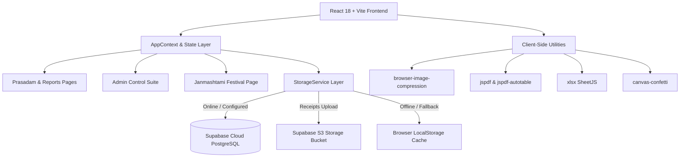
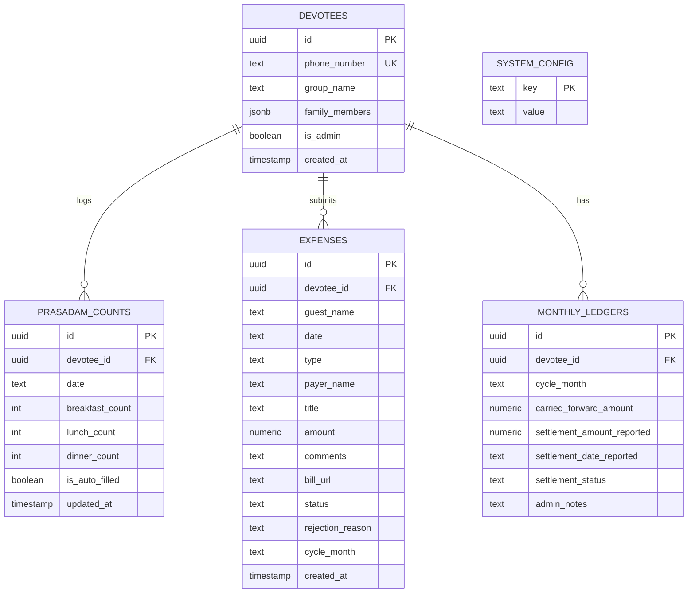

# 🪔 GNH Prasadam & Community Expense Management App

<div align="center">


### **A Progressive Web App (PWA) for Community Prasadam Tracking, Seva Expense Reconciliation, Monthly Ledgers, and WhatsApp Billing for Vaishnava Communities**

[](https://react.dev/)
[](https://www.typescriptlang.org/)
[](https://vitejs.dev/)
[](https://tailwindcss.com/)
[](https://supabase.com/)
[](https://web.dev/progressive-web-apps/)
[](LICENSE)

[Features](#-key-features) • [Business & Calculation Rules](#-business-rules--financial-formulas) • [Architecture](#-architecture--tech-stack) • [Database Schema](#-database-schema--storage) • [Local Setup](#-getting-started--local-development) • [Deployment](#-deployment-guide) • [PWA Guide](#-pwa-installation-guide)

</div>

---

## 📖 Overview

The **GNH Prasadam & Community Expense Management App** is a modern, high-performance Progressive Web App (PWA) tailored for a community of ~30 Vaishnava devotee families. It simplifies and automates:

1. **Daily Prasadam Booking & Meal Counting** across Breakfast, Lunch, and Dinner.
2. **Community Seva Expense Logging** with instant client-side receipt photo compression (<200 KB) and cloud storage.
3. **Automated Monthly Ledger Reconciliation** (Meal Costs + Community Maintenance Charges - Approved Seva Expenses + Carried Balances - Settlements).
4. **Special Festival Ledgers** (e.g., Sri Krishna Janmashtami fund tracking isolated from regular meal ledgers).
5. **One-Click WhatsApp Broadcasts** with personalized balance summaries and payment reminders.
6. **Multi-Format Reporting** with instant PDF statement downloads and multi-sheet Excel workbooks.

The app supports both online cloud synchronization with **Supabase PostgreSQL** and **Storage**, as well as instant offline fallback via reactive local storage.

---

## ✨ Key Features

### 🍱 1. Prasadam Meal Management
- **Intuitive Meal Counters**: Quick-increment / decrement buttons and direct numeric inputs for Breakfast, Lunch, and Dinner.
- **Dynamic Cost Feedback**: Real-time calculation of total meal charges based on active pricing.
- **Monthly Matrix View**: Devotees and admins can inspect daily counts across all calendar days of the month.
- **Strict Cutoff Enforcement**: Automatic freeze at **8:00 PM on the N-2 day of each month** (2 days before month end).
- **Smart Auto-Fill Algorithm**: Incomplete/empty booking days automatically backfill using the devotee's maximum entered meal count to ensure fair community catering provisions.

### 🧾 2. Expense & Receipt Logging
- **Two Expense Categories**:
  - `REGULAR`: Day-to-day grocery, vegetable, gas, and maintenance expenses that offset the devotee's monthly prasadam dues.
  - `JANMASHTAMI`: Dedicated festival expense fund isolated from standard monthly meal billing.
- **Payer Association**: Expenses can be logged by devotee family heads, individual family members, or guest contributors.
- **Client-Side Smart Image Compression**: Receipt photos of up to 10 MB are automatically compressed to `<200 KB` in the browser before upload, ensuring lightning-fast uploads and zero Supabase storage bloat.
- **High-Resolution Receipt Lightbox**: Admins and devotees can click on any receipt thumbnail to inspect full receipts with zoom/pan capabilities.
- **Admin Review Workflow**: Admins can approve or reject expenses with detailed reason notes.

### 📊 3. Monthly Financial Ledgers & Settlement
- **Automated Net Dues Engine**:
  $$\text{Final Balance} = (\text{Prasadam Cost} + \text{Community Cost}) - \text{Approved Regular Expenses} + \text{Carried Forward} - \text{Settled Amount}$$
- **Self-Reported Settlements**: Devotees can report payments directly in the app, triggering festive confetti animations and queueing verification for the administrator.
- **Admin Direct Settlement & Verification**: One-click settlement approval or direct ledger adjustment by administrators.
- **Monthly Balance Rollover**: Balances seamlessly carry forward from month to month with an administrative rollover trigger.

### 📱 4. WhatsApp Integration & Notifications
- **Pre-Formatted WhatsApp Summaries**: Generates personalized Vaishnava greeting messages, itemized breakdowns of meals consumed, expense offsets, and net balances due/refundable.
- **One-Click Direct Links**: Opens WhatsApp Web or the WhatsApp mobile app directly for specific devotees.
- **Family Member Routing**: Supports distinct mobile numbers for individual family members under the same group.

### 🔒 5. Secure Admin Dashboard & Controls
- **6-Digit Master PIN Protection**: Admin zone protected by PIN (default: `192108`), remembered locally on authenticated admin devices.
- **Master Devotee Management**: Add, edit, or remove devotee groups, assign phone numbers, and configure individual family member names with individual phone lines.
- **Full Community Matrix Table**: Interactive table with inline count editing across all days and devotees for administrator overrides.
- **Configurable Settings**: Adjust Community Maintenance Cost per member (default: ₹500), change admin PIN, or run factory database resets.

### 📄 6. Exports & Statements
- **Multi-Sheet Excel Workbook (`.xlsx`)**:
  - Sheet 1: Devotee Master Monthly Summary
  - Sheet 2: Daily Meal Count Log
  - Sheet 3: Expense & Receipt Ledger
- **Professional A4 PDF Statement (`.pdf`)**:
  - Formatted Vaishnava saffron header
  - Community-wide aggregates (Total Meals, Total Cost, Net Receivables, Net Payables)
  - Color-coded tabular breakdown of every devotee's balance status

### ⚡ 7. PWA & Device Support
- **Mobile-First & Desktop Responsive**: Optimized for iOS Safari, Android Chrome, and Desktop browsers.
- **Home Screen Installable**: Full PWA support with standalone window, custom icons, and auto-updating service worker via `vite-plugin-pwa`.
- **Dark & Light Mode**: Saffron/amber Vaishnava cultural aesthetic with dark slate mode support.

---

## 🧮 Business Rules & Financial Formulas

### 1. Prasadam Meal Rates
| Meal Slot | Rate per Meal | Notes |
| :--- | :---: | :--- |
| **Breakfast** | **₹40** | Morning Prasadam |
| **Lunch** | **₹80** | Afternoon Rajbhog Prasadam |
| **Dinner** | **₹40** | Evening Prasadam |

### 2. Financial Ledger Formula
```
[Total Meals Cost]       = (Breakfast × ₹40) + (Lunch × ₹80) + (Dinner × ₹40)
[Community Cost]        = (Family Member Count) × (Community Cost Per Member [default: ₹500])
[Total Prasadam Cost]   = [Total Meals Cost] + [Community Cost]

[Current Month Net]     = [Total Prasadam Cost] - [Approved Regular Expenses]
[Final Balance Due]     = [Current Month Net] + [Carried Forward Balance] - [Settled Amount]
```
- **Positive Balance ($> ₹0$)**: Devotee owes money to GNH.
- **Negative Balance ($< ₹0$)**: GNH owes reimbursement to the Devotee.
- **Zero Balance ($= ₹0$)**: Account fully settled.

### 3. Monthly Cutoff Deadline
- **Cutoff Time**: Exactly **8:00 PM (20:00:00)** on the **N-2 day** of the active month (2 days before month end).
  - *Example for August (31 days)*: August 29 at 8:00 PM.
  - *Example for February (28 days)*: February 26 at 8:00 PM.
- **Lockdown Behavior**: Once cutoff passes, devotee inputs freeze. Only the Admin PIN can unlock or edit counts.
- **Countdown Timer**: Real-time countdown timer in the navbar displays remaining time before cutoff.

### 4. Missing Count Auto-Fill Algorithm
If a devotee leaves days unbooked before the cutoff:
$$\text{Auto-fill Count for Day } d = \left( \max_{t \in \text{Entered Days}}(B_t), \max_{t \in \text{Entered Days}}(L_t), \max_{t \in \text{Entered Days}}(D_t) \right)$$
*(If no entries were made by the devotee during the entire month, it defaults to 1 per meal slot).*

---

## 🏗 Architecture & Tech Stack



### Core Technologies
| Category | Technology | Purpose |
| :--- | :--- | :--- |
| **Framework** | [React 18](https://react.dev/) | Component-based UI library |
| **Language** | [TypeScript 5](https://www.typescriptlang.org/) | Type safety and domain models |
| **Build Tool** | [Vite 6](https://vitejs.dev/) | Lightning-fast HMR and bundling |
| **Styling** | [Tailwind CSS 3](https://tailwindcss.com/) | Responsive styling, dark mode, animations |
| **PWA** | [Vite PWA Plugin](https://vite-pwa-org.netlify.app/) | Service worker, caching, offline manifest |
| **Icons** | [Lucide React](https://lucide.dev/) | Clean, accessible vector icons |
| **Database** | [Supabase](https://supabase.com/) | PostgreSQL database with Row Level Security |
| **File Storage** | [Supabase Storage](https://supabase.com/storage) | S3-compatible bucket for receipt photos |
| **Image Compression** | [browser-image-compression](https://www.npmjs.com/package/browser-image-compression) | Client-side JPEG/PNG compression (<200 KB) |
| **Exports** | [jsPDF](https://github.com/parallax/jsPDF) & [XLSX](https://sheetjs.com/) | Client-side PDF statement and Excel export |
| **Deployment** | [Vercel](https://vercel.com/) | Edge hosting and CI/CD deployment |

---

## 📁 Project Structure

```
GNHApp/
├── public/
│   ├── favicon.ico
│   ├── GNHLogo.png              # High-resolution primary brand logo
│   ├── logo.png                 # App icon
│   └── robots.txt
├── src/
│   ├── components/
│   │   ├── auth/
│   │   │   ├── AdminPinModal.tsx    # 6-digit PIN authentication modal
│   │   │   └── LoginModal.tsx       # Phone / Guest login dialog
│   │   ├── common/
│   │   │   ├── Badge.tsx            # Status pills (Approved, Pending, Rejected)
│   │   │   ├── Button.tsx           # Standard interactive buttons
│   │   │   ├── Card.tsx             # Glassmorphic container cards
│   │   │   ├── FluteIcon.tsx        # Vaishnava flute SVG motif
│   │   │   ├── Modal.tsx            # Accessible modal dialog wrapper
│   │   │   └── Toast.tsx            # Animated notifications container
│   │   └── layout/
│   │       ├── Navbar.tsx           # Sticky brand header & cutoff countdown
│   │       └── TabBar.tsx           # Navigation tab bar (Reports, Prasadam, etc.)
│   ├── context/
│   │   └── AppContext.tsx           # Global state, authentication, and data hooks
│   ├── data/
│   │   └── seedDevotees.ts          # Initial seed dataset of 30 devotee groups
│   ├── pages/
│   │   ├── AdminPage.tsx            # Matrix, Expenses, Settlements, WhatsApp, Settings
│   │   ├── JanmashtamiPage.tsx      # Sri Krishna Janmashtami expense tracker
│   │   ├── LoginPage.tsx            # Mobile-first login and authentication landing
│   │   ├── PrasadamPage.tsx         # Devotee booking & expense submission page
│   │   └── ReportsPage.tsx          # Monthly balance report & self-settlement
│   ├── services/
│   │   ├── storageService.ts        # Hybrid Supabase Cloud & LocalStorage abstraction
│   │   └── supabase.ts              # Supabase client initializer
│   ├── types/
│   │   └── index.ts                 # Core TypeScript interfaces & types
│   ├── utils/
│   │   ├── calculations.ts          # Rates, cutoffs, auto-fills, and summaries
│   │   ├── cn.ts                    # ClassName merge helper (clsx + tailwind-merge)
│   │   ├── devoteeHelpers.ts        # Family member phone resolution helpers
│   │   ├── exportHelpers.ts         # Excel & PDF document generators
│   │   └── imageCompressor.ts       # Browser-based image compression utility
│   ├── App.tsx                      # Main application layout and routing
│   ├── index.css                    # Tailwind directives and custom scrollbars
│   └── main.tsx                     # React root DOM mounting
├── supabase_schema_and_seed.sql     # Full Supabase DB schema, RLS policies, and seed data
├── DEPLOYMENT_GUIDE.md              # Detailed Supabase & Vercel deployment instructions
├── tailwind.config.js               # Tailwind theme configuration
├── tsconfig.json                    # TypeScript compiler options
├── vercel.json                      # Vercel SPA routing redirects
├── vite.config.ts                   # Vite & PWA configuration
└── package.json                     # Dependencies and build scripts
```

---

## 🗄 Database Schema & Storage

The application uses **5 relational tables** in PostgreSQL (managed via Supabase) with Row-Level Security enabled:



### Storage Bucket
- **Bucket Name**: `receipts`
- **Public Access**: Enabled for read access (`public.receipts`).
- **File Format**: `receipts/{cycle_month}_{timestamp}_{random}.jpg` compressed client-side.

---

## 🚀 Getting Started & Local Development

### Prerequisites
- **Node.js**: v18.0.0 or higher
- **npm** or **pnpm** or **yarn**

### 1. Clone Repository
```bash
git clone https://github.com/YOUR_USERNAME/GNHApp.git
cd GNHApp
```

### 2. Install Dependencies
```bash
npm install
```

### 3. Setup Environment Variables (Optional for Cloud Sync)
Create a `.env` file in the root directory:
```env
VITE_SUPABASE_URL=https://your-project-id.supabase.co
VITE_SUPABASE_ANON_KEY=your_supabase_anon_public_key
```
> **Note**: If `.env` is omitted, the app will automatically run in local browser storage mode with default devotee data.

### 4. Start Development Server
```bash
npm run dev
```
Open your browser at `http://localhost:5173`.

### 5. Build for Production
```bash
npm run build
npm run preview
```

---

## 🌐 Deployment Guide

For an in-depth step-by-step tutorial, refer to [DEPLOYMENT_GUIDE.md](DEPLOYMENT_GUIDE.md).

### Quick Deployment Summary:

1. **Supabase Database Setup**:
   - Create a project on [Supabase](https://supabase.com).
   - Go to **SQL Editor**, paste the contents of [`supabase_schema_and_seed.sql`](supabase_schema_and_seed.sql), and run.
   - Copy **Project URL** and **Anon Key** from **Project Settings -> API**.

2. **Vercel Frontend Hosting**:
   - Push your code to GitHub.
   - Import the repository on [Vercel](https://vercel.com).
   - Add environment variables:
     - `VITE_SUPABASE_URL`
     - `VITE_SUPABASE_ANON_KEY`
   - Click **Deploy**.

---

## 📲 PWA Installation Guide

The app can be installed directly onto any mobile phone or desktop without app store downloads:

### On Android (Google Chrome)
1. Open the deployed application URL in Chrome.
2. Tap the **three dots (⋮)** menu at the top right.
3. Select **Add to Home screen** or **Install App**.
4. The GNH Seva App icon will appear on your device launcher.

### On iOS (Apple Safari)
1. Open the deployed application URL in Safari.
2. Tap the **Share** button (box with an upward arrow) at the bottom.
3. Scroll down and tap **Add to Home Screen**.
4. Tap **Add** in the top-right corner.

### On Desktop (Chrome / Edge / Brave)
1. Look for the **Install App (computer/download icon)** on the right side of the address bar.
2. Click **Install** to run the app in its own dedicated window.

---

## 🔑 Default Credentials & Shortcuts

| Item | Default Value / Shortcut | Description |
| :--- | :--- | :--- |
| **Admin Default PIN** | `192108` | Access admin panel at `?tab=admin` (Can be modified in Settings) |
| **Direct Admin URL** | `https://your-domain.vercel.app/?tab=admin` | Directly triggers the Admin PIN challenge modal |
| **Direct Devotee URL** | `https://your-domain.vercel.app/?phone=9876543210` | Automatically logs in as the devotee matching the phone |
| **Direct Tab URL** | `https://your-domain.vercel.app/?tab=reports` | Loads Reports, Prasadam, or Janmashtami tab directly |

---

## 🤝 Contributing

Contributions are welcome! If you would like to enhance the app:
1. Fork the Project (`git checkout -b feature/AmazingFeature`)
2. Commit your Changes (`git commit -m 'Add some AmazingFeature'`)
3. Push to the Branch (`git push origin feature/AmazingFeature`)
4. Open a Pull Request

---

## 📜 License

Distributed under the **MIT License**. See `LICENSE` for more information.

<div align="center">

**Hare Krishna! Made with devotion for the GNH Vaishnava Community.**

</div>
